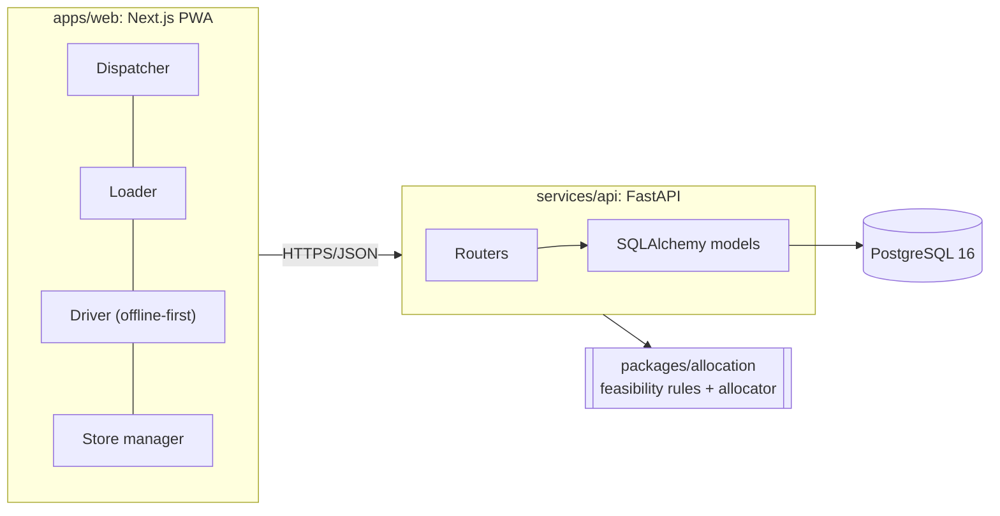

# Architecture

> Judge-facing copy. The team's full design notes live in the workspace (`02-plan/SYSTEM-ARCHITECTURE.md`); keep this file in sync with what is actually built.

| Component | Tech | Responsibility |
|---|---|---|
| `apps/web` | Next.js 15, TypeScript, Tailwind | One responsive app with 4 role areas; driver works offline |
| `services/api` | FastAPI, SQLAlchemy 2, Alembic | REST API, auth/RBAC, sync endpoint, seed |
| `packages/allocation` | Python (no deps) | Trip time, feasibility rules, allocation algorithm |
| `db` | PostgreSQL 16 | All persistent state |

## Status
- [x] Scaffold: Compose, health check, reference data seeded
- [ ] Auth + 4 seeded role accounts
- [ ] Orders → plan → load → deliver → receipt
- [ ] Offline sync
