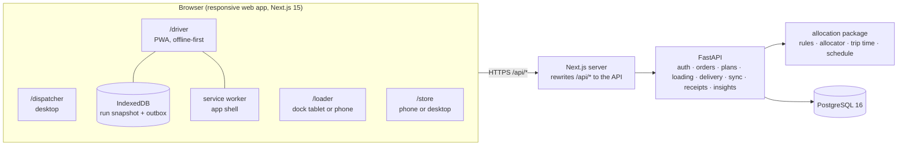
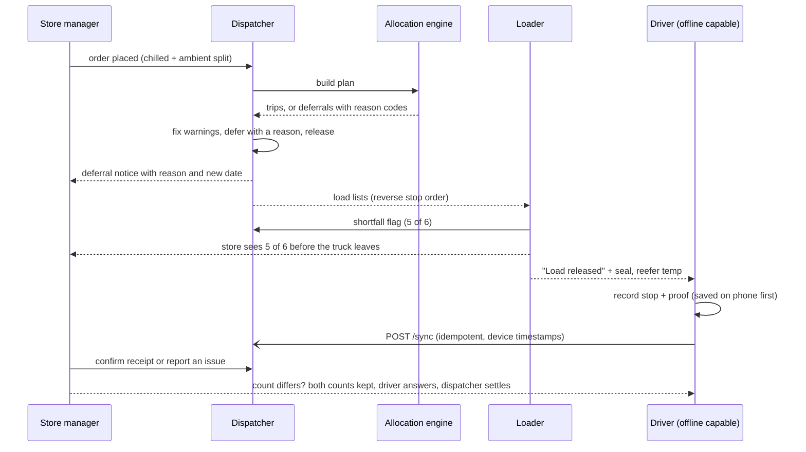

# Architecture

One shared record connects order → plan → load → deliver → receipt for four roles. Everything runs from `docker compose up`.

## Stack

| Layer | Choice | Why |
|---|---|---|
| Web | Next.js 15 (App Router), TypeScript, Tailwind 4 | One app with four role areas; installable PWA for the driver. Daylight/Dark tokens live in `globals.css`. |
| API | FastAPI, SQLAlchemy 2, Alembic, PyJWT | Typed, self-documenting (`/docs`), small. |
| Database | PostgreSQL 16 (SQLite in tests) | Portable JSON columns, so the same models run in both. |
| Allocation | `packages/allocation` (pure Python, no dependencies) | The same rules the Datathon Task 2B notebook uses; tested against the organisers' `check_allocation.py`. |
| Packaging | Docker Compose: `db`, `api` (migrate + seed + serve), `web` | `docker compose up` = full stack with a queued demo day. |

The browser talks only to `/api/*` on its own origin; Next forwards it to the API, so there is no CORS to configure and no API address in the client bundle.

## The four roles and how a decision reaches the next

## Allocation engine (`packages/allocation`)

1. **Priority**: skipped yesterday (+1000, never skip an outlet twice), days since served, chilled Fresh, tight window, festival ramp.
2. **Placement**: highest priority first, largest first within a tier (first-fit decreasing). An order joins an open trip of the same brand and district if it fits (preferring the trip already visiting that outlet), otherwise opens a trip on the **smallest legal vehicle**, keeping big trucks and reefers free.
3. **Checked on every placement**: weight and volume, chilled → reefer only, `van_only` → vans only, home depot, two trips per vehicle, the daily time budget (Fresh ≤ 270 min, Style + Tech ≤ 480 min), weekly fuel quota.
4. **Leftovers** become a `Deferral` with a reason code: `capacity_volume`, `capacity_weight`, `no_reefer`, `no_van`, `time_budget`, `fuel_quota` (`manual` is the dispatcher's).
5. `validate()` re-runs on every dispatcher edit and returns the warnings on the plan board. Red warnings block release; amber are cautions.
6. `schedule.py` sequences stops by window and estimates arrival times (a mall stop never arrives before its window opens).

Trip time is the booklet's formula, `depot_to_district + inter_stop × (stops − 1) + Σ service_allowance`, identical to `check_allocation.py`.

## Offline driver

- The run, the outbox and the PIN hash live in **IndexedDB**. Every action is applied to the phone's copy first and appended to the outbox with a **client UUID** and the **device timestamp**.
- `POST /sync` sends the outbox oldest first. The server dedupes on the UUID, so a retry can never double-apply.
- Delivery events are append-only, so they do not conflict. A stop that dispatch **moved while the driver was offline** raises a `reassigned` conflict for the dispatcher. A store count that **differs from the driver's** raises a `count` conflict: neither is overwritten; the driver accepts or disputes, the dispatcher settles.
- A **service worker** caches the app shell so the PWA opens with no signal after the first visit. `/api/*` is never cached by it.
- The driver Help screen has a **Simulate no signal** switch that takes the app through the same path as a real outage.

## Live updates

Dispatcher, loader and store screens poll (3–5 s) and show small toasts for new events. Server-Sent Events are the natural next step (see `design-departures.md`).

## Security

Passwords and loader PINs are PBKDF2-hashed. Sessions are signed JWTs. Every route checks the role; store managers see only their outlet. Drivers' PINs never leave the phone.

## Testing and CI

`packages/allocation` (unit tests + the booklet's worked examples), `services/api` (an end-to-end test of one day through all four roles on SQLite, plus role, plan-edit, plan-change and demand tests), and the web app (`eslint`, `tsc`, `next build`). GitHub Actions runs all of them on every PR.
