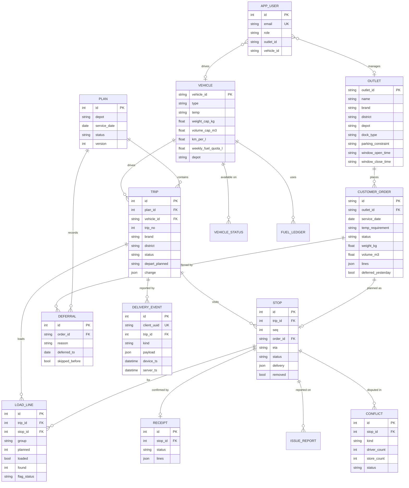

# Data model

Reference tables are seeded 1:1 from the organisers' CSVs (`services/api/seed/data/`). Operational tables are the shared record the four roles write to. Migrations: `0001` (reference), `0002` (operations + outlet display name).

Other tables: `notification` (structured messages between roles: deferral alerts, plan changes, flags; no free chat), `item` (the order catalogue with kg and m³ per unit), `issue_report`, and the seeded reference tables `calendar_day`, `district_travel`, `service_allowance`, `traffic_speed`, `road_condition`.

## Order lifecycle

`confirmed → planned | deferred → loaded | shortfall → out_for_delivery → delivered | partial | failed → received | issue_reported`

A store basket with chilled and dry lines becomes **two orders** (one per temperature), exactly like the dataset, so chilled goods can be routed to a reefer independently.

## Trip lifecycle

`planned → loading → released` (by the loader, with reefer temperature and seal) `→ out → completed`. Editing a released plan bumps `plan.version`, diffs each affected trip's `load_line` rows and stores the difference in `trip.change` (add / take off). Removed stops are kept (`stop.removed`) so a driver's late record for them becomes a conflict instead of vanishing.

## The seeded demo day

`demo_orders.csv` holds 151 real orders (58 Kandy, 93 Peliyagoda) from the heaviest historical day, re-dated to `DEMO_SERVICE_DATE` (Mon 5 Oct 2026). Four Kandy reefer trucks are in the workshop and the week's fuel is partly used, so demand exceeds capacity and the engine defers orders with reasons. `POST /demo/reset` restores it.
